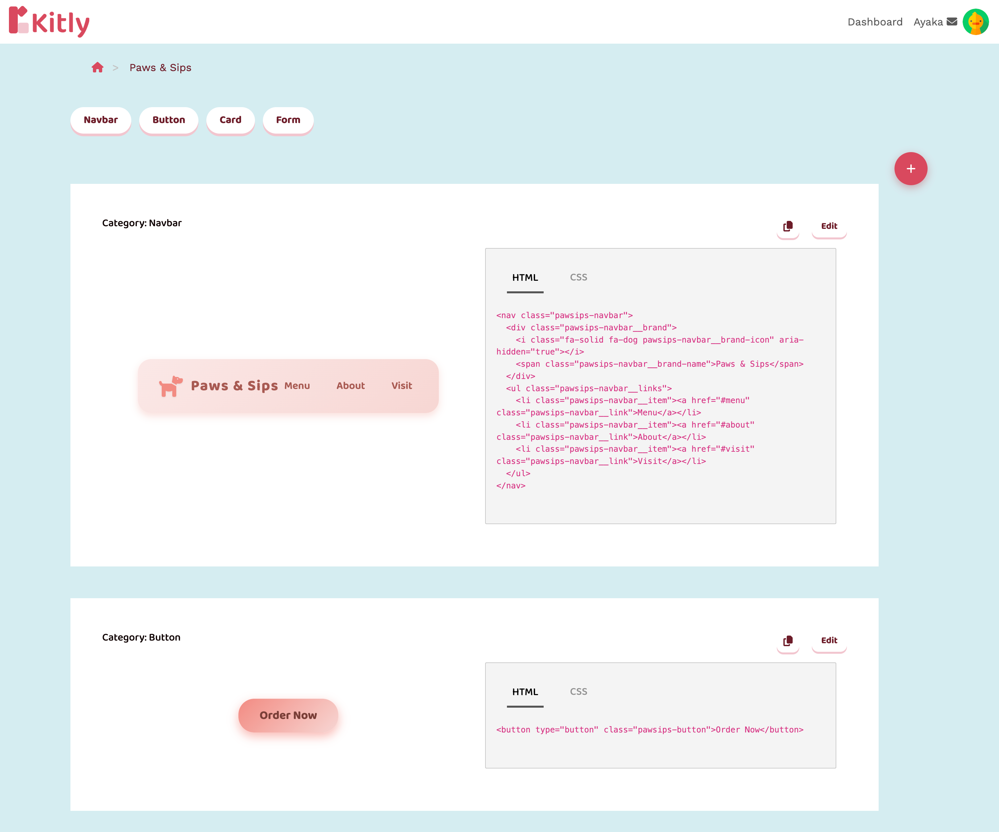

# Kitly

Kitly turns a short description of your website into a ready-to-use UI kit.

Tell Kitly what you are building, for example, "a cozy bakery website with warm, handmade vibes." It then creates a themed UI kit with matching components, such as a navbar, button, card, and form. You get the HTML and CSS for each component, and you can copy it straight into your project.

## Demo

[View Kitly](https://kitly-5add6d99969e.herokuapp.com/)

## Screenshots



## Features

- **Generate a UI kit from a prompt.** Describe your website in your own words. Kitly names the kit, creates a description of its visual theme, and automatically generates the first set of components.
- **Consistent design.** Every component in a kit uses the same color palette, typography, spacing, and mood, so they look like they belong together.
- **Edit components by chatting.** Open a component and ask for a change, such as "make the button rounder" or "use a darker background." Kitly updates the HTML and CSS for you.
- **Add new components.** Ask for a new component from a kit's page. Kitly matches it to the styles the kit already uses.
- **Copy the code.** Each component shows a live preview next to its HTML and CSS, with a copy button.
- **Browse by category.** Components are grouped by category, with anchor links to jump between them.

## How it works

1. Sign up and log in. Kitly adds an example kit to your account so you can see what a kit looks like.
2. Describe the website you want to build.
3. Kitly sets the kit's name and visual theme, then generates the initial components.
4. Open the kit to preview the components, edit them by chatting, add new ones, or copy the HTML and CSS.

## Tech stack

- Ruby 3.3.5
- Rails 8.1
- PostgreSQL
- Hotwire (Turbo and Stimulus) with importmap
- Bootstrap 5
- Simple Form
- Font Awesome
- Devise for authentication
- [RubyLLM](https://rubyllm.com) with OpenAI `gpt-4.1-mini`, using tool calls to create and update components
- Solid Queue for background jobs

## Getting started

### Requirements

Make sure you have the following installed:

- Ruby 3.3.5
- PostgreSQL
- An OpenAI API key

### Setup

Clone the repository and install the dependencies:

```bash
git clone https://github.com/ayakakikuchi-222/kitly.git
cd kitly
bundle install
```

Create a `.env` file in the project root and add your OpenAI API key:

```env
OPENAI_API_KEY=your_api_key_here
```

Do not commit your `.env` file or API key to GitHub.

Set up the database:

```bash
bin/rails db:create db:migrate
```

Start the development server:

```bash
bin/dev
```

Then open:

[http://localhost:3000](http://localhost:3000)

## Team

- [Ayaka Kikuchi](https://github.com/ayakakikuchi-222)
- [Drew Holmes](https://github.com/dholmes-jp)
- [Kylie Lin](https://github.com/kylvi)

---

Rails app generated with [lewagon/rails-templates](https://github.com/lewagon/rails-templates), created by the [Le Wagon coding bootcamp](https://www.lewagon.com) team.
